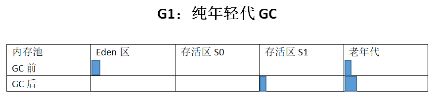
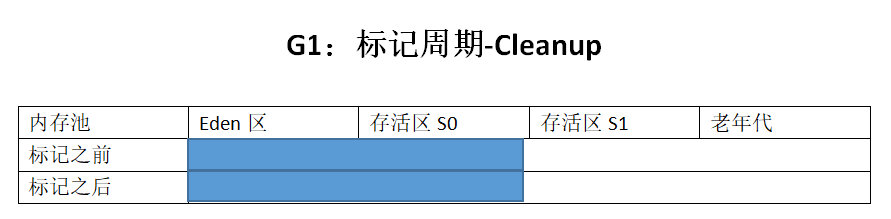

# 前言
这些GC日志相关的配置都是基于JDK8，8以后的版本的一些参数配置可能不太一样，这里放一个JDK11的参数配置```java -Xms512m -Xmx512m -Xlog:gc*=info:file=gc.log.time:filecount=0 GCLogAnalysis```，这里还给出一个在线分析gclog文件的网站，有兴趣的可以上去看看 ```https://gceasy.io```
# G1 GC日志分析
启动参数设置为：
```
-XX:+PrintGCDetails
-Xloggc:gc.demo.log
-XX:+PrintGCDateStamps
-Xms512m
-Xmx512m
-XX:+UseG1GC
```
G1GC的日志可能会比较多，我电脑上运行有3千多行，不像其它的GC,不超过100行。这里只是个大概值，每个人电脑上跑出来的日志可能不一样。日志太多，下面会截取一部分的日志来分析(两个young GC，一个 mixed GC)。

```
Java HotSpot(TM) 64-Bit Server VM (25.212-b10) for windows-amd64 JRE (1.8.0_212-b10), built on Apr  1 2019 22:50:23 by "java_re" with MS VC++ 10.0 (VS2010)
Memory: 4k page, physical 16637352k(9807532k free), swap 26598824k(16112660k free)
CommandLine flags: -XX:InitialHeapSize=536870912 -XX:MaxHeapSize=536870912 -XX:+PrintGC -XX:+PrintGCDateStamps -XX:+PrintGCDetails -XX:+PrintGCTimeStamps -XX:+UseCompressedClassPointers -XX:+UseCompressedOops -XX:+UseG1GC -XX:-UseLargePagesIndividualAllocation 
2021-03-15T17:49:07.952+0800: 0.358: [GC pause (G1 Evacuation Pause) (young), 0.0062950 secs]
   [Parallel Time: 5.6 ms, GC Workers: 10]
      [GC Worker Start (ms): Min: 358.0, Avg: 358.1, Max: 358.2, Diff: 0.2]
      [Ext Root Scanning (ms): Min: 0.0, Avg: 0.1, Max: 0.2, Diff: 0.1, Sum: 0.8]
      [Update RS (ms): Min: 0.1, Avg: 0.1, Max: 0.1, Diff: 0.1, Sum: 1.0]
         [Processed Buffers: Min: 0, Avg: 1.5, Max: 2, Diff: 2, Sum: 15]
      [Scan RS (ms): Min: 0.0, Avg: 0.0, Max: 0.0, Diff: 0.0, Sum: 0.1]
      [Code Root Scanning (ms): Min: 0.0, Avg: 0.0, Max: 0.0, Diff: 0.0, Sum: 0.0]
      [Object Copy (ms): Min: 5.2, Avg: 5.2, Max: 5.3, Diff: 0.2, Sum: 52.2]
      [Termination (ms): Min: 0.0, Avg: 0.1, Max: 0.2, Diff: 0.2, Sum: 1.2]
         [Termination Attempts: Min: 1, Avg: 1.4, Max: 2, Diff: 1, Sum: 14]
      [GC Worker Other (ms): Min: 0.0, Avg: 0.0, Max: 0.0, Diff: 0.0, Sum: 0.1]
      [GC Worker Total (ms): Min: 5.4, Avg: 5.5, Max: 5.6, Diff: 0.2, Sum: 55.3]
      [GC Worker End (ms): Min: 363.6, Avg: 363.6, Max: 363.6, Diff: 0.0]
   [Code Root Fixup: 0.0 ms]
   [Code Root Purge: 0.0 ms]
   [Clear CT: 0.1 ms]
   [Other: 0.5 ms]
      [Choose CSet: 0.0 ms]
      [Ref Proc: 0.1 ms]
      [Ref Enq: 0.0 ms]
      [Redirty Cards: 0.2 ms]
      [Humongous Register: 0.0 ms]
      [Humongous Reclaim: 0.0 ms]
      [Free CSet: 0.0 ms]
   [Eden: 101.0M(101.0M)->0.0B(242.0M) Survivors: 11.0M->14.0M Heap: 241.5M(512.0M)->152.3M(512.0M)]
 [Times: user=0.02 sys=0.13, real=0.01 secs] 
2021-03-15T17:49:08.006+0800: 0.412: [GC pause (G1 Humongous Allocation) (young) (initial-mark), 0.0107640 secs]
   [Parallel Time: 9.4 ms, GC Workers: 10]
      [GC Worker Start (ms): Min: 411.8, Avg: 411.8, Max: 411.9, Diff: 0.1]
      [Ext Root Scanning (ms): Min: 0.0, Avg: 0.1, Max: 0.1, Diff: 0.1, Sum: 0.8]
      [Update RS (ms): Min: 0.1, Avg: 0.1, Max: 0.2, Diff: 0.1, Sum: 1.0]
         [Processed Buffers: Min: 0, Avg: 1.6, Max: 2, Diff: 2, Sum: 16]
      [Scan RS (ms): Min: 0.0, Avg: 0.0, Max: 0.0, Diff: 0.0, Sum: 0.1]
      [Code Root Scanning (ms): Min: 0.0, Avg: 0.0, Max: 0.0, Diff: 0.0, Sum: 0.0]
      [Object Copy (ms): Min: 8.9, Avg: 9.0, Max: 9.1, Diff: 0.2, Sum: 89.8]
      [Termination (ms): Min: 0.0, Avg: 0.1, Max: 0.2, Diff: 0.2, Sum: 1.0]
         [Termination Attempts: Min: 1, Avg: 1.4, Max: 2, Diff: 1, Sum: 14]
      [GC Worker Other (ms): Min: 0.0, Avg: 0.0, Max: 0.0, Diff: 0.0, Sum: 0.1]
      [GC Worker Total (ms): Min: 9.2, Avg: 9.3, Max: 9.3, Diff: 0.1, Sum: 92.9]
      [GC Worker End (ms): Min: 421.1, Avg: 421.1, Max: 421.1, Diff: 0.0]
   [Code Root Fixup: 0.0 ms]
   [Code Root Purge: 0.0 ms]
   [Clear CT: 0.4 ms]
   [Other: 0.9 ms]
      [Choose CSet: 0.0 ms]
      [Ref Proc: 0.2 ms]
      [Ref Enq: 0.0 ms]
      [Redirty Cards: 0.4 ms]
      [Humongous Register: 0.0 ms]
      [Humongous Reclaim: 0.1 ms]
      [Free CSet: 0.1 ms]
   [Eden: 187.0M(242.0M)->0.0B(157.0M) Survivors: 14.0M->32.0M Heap: 382.5M(512.0M)->211.5M(512.0M)]
 [Times: user=0.00 sys=0.00, real=0.01 secs] 
2021-03-15T17:49:08.017+0800: 0.423: [GC concurrent-root-region-scan-start]
2021-03-15T17:49:08.017+0800: 0.423: [GC concurrent-root-region-scan-end, 0.0005681 secs]
2021-03-15T17:49:08.017+0800: 0.423: [GC concurrent-mark-start]
2021-03-15T17:49:08.018+0800: 0.424: [GC concurrent-mark-end, 0.0008918 secs]
2021-03-15T17:49:08.018+0800: 0.424: [GC remark 2021-03-15T17:49:08.018+0800: 0.424: [Finalize Marking, 0.0002256 secs] 2021-03-15T17:49:08.019+0800: 0.424: [GC ref-proc, 0.0000637 secs] 2021-03-15T17:49:08.019+0800: 0.424: [Unloading, 0.0006521 secs], 0.0014288 secs]
 [Times: user=0.00 sys=0.00, real=0.00 secs] 
2021-03-15T17:49:08.020+0800: 0.426: [GC cleanup 228M->228M(512M), 0.0005037 secs]
 [Times: user=0.00 sys=0.00, real=0.00 secs] 
2021-03-15T17:49:08.043+0800: 0.449: [GC pause (G1 Evacuation Pause) (young) (to-space exhausted), 0.0069806 secs]
   [Parallel Time: 5.6 ms, GC Workers: 10]
      [GC Worker Start (ms): Min: 448.8, Avg: 448.9, Max: 449.0, Diff: 0.2]
      [Ext Root Scanning (ms): Min: 0.0, Avg: 0.1, Max: 0.2, Diff: 0.2, Sum: 0.8]
      [Update RS (ms): Min: 0.1, Avg: 0.2, Max: 0.3, Diff: 0.1, Sum: 1.8]
         [Processed Buffers: Min: 0, Avg: 2.9, Max: 4, Diff: 4, Sum: 29]
      [Scan RS (ms): Min: 0.0, Avg: 0.0, Max: 0.0, Diff: 0.0, Sum: 0.1]
      [Code Root Scanning (ms): Min: 0.0, Avg: 0.0, Max: 0.0, Diff: 0.0, Sum: 0.0]
      [Object Copy (ms): Min: 4.9, Avg: 5.0, Max: 5.1, Diff: 0.2, Sum: 50.1]
      [Termination (ms): Min: 0.0, Avg: 0.1, Max: 0.1, Diff: 0.1, Sum: 0.5]
         [Termination Attempts: Min: 1, Avg: 1.0, Max: 1, Diff: 0, Sum: 10]
      [GC Worker Other (ms): Min: 0.0, Avg: 0.0, Max: 0.0, Diff: 0.0, Sum: 0.1]
      [GC Worker Total (ms): Min: 5.3, Avg: 5.4, Max: 5.4, Diff: 0.2, Sum: 53.5]
      [GC Worker End (ms): Min: 454.2, Avg: 454.2, Max: 454.3, Diff: 0.0]
   [Code Root Fixup: 0.0 ms]
   [Code Root Purge: 0.0 ms]
   [Clear CT: 0.1 ms]
   [Other: 1.3 ms]
      [Evacuation Failure: 0.8 ms]
      [Choose CSet: 0.0 ms]
      [Ref Proc: 0.2 ms]
      [Ref Enq: 0.0 ms]
      [Redirty Cards: 0.2 ms]
      [Humongous Register: 0.1 ms]
      [Humongous Reclaim: 0.0 ms]
      [Free CSet: 0.0 ms]
   [Eden: 157.0M(157.0M)->0.0B(5120.0K) Survivors: 32.0M->24.0M Heap: 409.7M(512.0M)->326.2M(512.0M)]
 [Times: user=0.00 sys=0.00, real=0.01 secs] 
2021-03-15T17:49:08.051+0800: 0.457: [GC pause (G1 Evacuation Pause) (mixed), 0.0038469 secs]
   [Parallel Time: 3.1 ms, GC Workers: 10]
      [GC Worker Start (ms): Min: 456.7, Avg: 456.7, Max: 456.8, Diff: 0.1]
      [Ext Root Scanning (ms): Min: 0.0, Avg: 0.1, Max: 0.1, Diff: 0.1, Sum: 0.8]
      [Update RS (ms): Min: 0.0, Avg: 0.0, Max: 0.1, Diff: 0.1, Sum: 0.4]
         [Processed Buffers: Min: 0, Avg: 1.2, Max: 3, Diff: 3, Sum: 12]
      [Scan RS (ms): Min: 0.0, Avg: 0.0, Max: 0.0, Diff: 0.0, Sum: 0.1]
      [Code Root Scanning (ms): Min: 0.0, Avg: 0.0, Max: 0.0, Diff: 0.0, Sum: 0.0]
      [Object Copy (ms): Min: 2.9, Avg: 2.9, Max: 3.0, Diff: 0.1, Sum: 29.1]
      [Termination (ms): Min: 0.0, Avg: 0.0, Max: 0.1, Diff: 0.1, Sum: 0.4]
         [Termination Attempts: Min: 1, Avg: 1.0, Max: 1, Diff: 0, Sum: 10]
      [GC Worker Other (ms): Min: 0.0, Avg: 0.0, Max: 0.0, Diff: 0.0, Sum: 0.1]
      [GC Worker Total (ms): Min: 3.0, Avg: 3.1, Max: 3.1, Diff: 0.1, Sum: 30.8]
      [GC Worker End (ms): Min: 459.8, Avg: 459.8, Max: 459.8, Diff: 0.0]
   [Code Root Fixup: 0.0 ms]
   [Code Root Purge: 0.0 ms]
   [Clear CT: 0.2 ms]
   [Other: 0.5 ms]
      [Choose CSet: 0.0 ms]
      [Ref Proc: 0.2 ms]
      [Ref Enq: 0.0 ms]
      [Redirty Cards: 0.2 ms]
      [Humongous Register: 0.0 ms]
      [Humongous Reclaim: 0.0 ms]
      [Free CSet: 0.0 ms]
   [Eden: 5120.0K(5120.0K)->0.0B(85.0M) Survivors: 24.0M->1024.0K Heap: 331.2M(512.0M)->312.2M(512.0M)]
 [Times: user=0.00 sys=0.00, real=0.00 secs]  
```
(1). Evacuation Pause: young(纯年轻代模式转移暂停)
当年轻代空间满了之后，应用线程会被暂停，年轻代内存块中的存活对象被拷贝到存活区。如果还没有存活区，则任意选择一部分空闲的内存块作为存活区。
拷贝的过程称为转移(Evacuation)，这个和其它年轻代收集器工作原理一样。每一段日志信息都比较长，这里会去掉一些后面再分析的日志，下面是抽取了一部分 Evacuation 的日志：
```
1 2021-03-15T17:49:07.952+0800: 0.358: 
2 [GC pause (G1 Evacuation Pause) (young), 0.0062950 secs]
3   [Parallel Time: 5.6 ms, GC Workers: 10]
      ......
4   [Code Root Fixup: 0.0 ms]
5   [Code Root Purge: 0.0 ms]
6   [Clear CT: 0.1 ms]
7   [Other: 0.5 ms]
      ......
8   [Eden: 101.0M(101.0M)->0.0B(242.0M) Survivors: 11.0M->14.0M Heap: 241.5M(512.0M)->152.3M(512.0M)]
9 [Times: user=0.02 sys=0.13, real=0.01 secs] 
```
第一行表示发生GC事件的开始时间点，+0800 表示当前时区，0.358：表示这次GC事件对于JVM启动时间的间隔，单位是秒。
第二行的 [GC pause (G1 Evacuation Pause) (young), 0.0062950 secs] 表示 G1 转移暂停，纯年轻代模式，只清理年轻代空间，一共用了 0.0062950 secs 秒，也就是 6.2ms。
第三行的  [Parallel Time: 5.6 ms, GC Workers: 10] 表示后面的活动由10个 Worker 线程并行执行，消耗时间为 5.6ms(真实的时间)。这里的 Worker 表示一种模式，类似于一个老板指挥多个人干活。
第四行 [Code Root Fixup: 0.0 ms] 表示释放用于管理并行活动的内部数据，一般时间接近于0，因为这个可以并行执行的。
第五行 [Code Root Purge: 0.0 ms] 表示清理其他部分数据，时间基本上也是0，因为也是并行的。
第七行 [Other: 0.5 ms] 表示其它活动消耗的时间，大部分是并行执行。
第八行 [Eden: 101.0M(101.0M)->0.0B(242.0M) Survivors: 11.0M->14.0M Heap: 241.5M(512.0M)->152.3M(512.0M)] ``` Eden: 101.0M(101.0M)->0.0B(242.0M) ``` 表示暂停之前和暂停之后，Eden 区的使用量(总容量);```Survivors: 11.0M->14.0M``` 表示GC暂停前后，存活区的使用量;```Heap: 241.5M(512.0M)->152.3M(512.0M)```暂停前后，整个堆内存的使用量(总容量)。
第九行 [Times: user=0.02 sys=0.13, real=0.01 secs] 表示这次GC花费的时间，user 线程用的时间，sys 系统用的时间，real 程序暂停的时间。
(2). worker 线程
```
1   [Parallel Time: 5.6 ms, GC Workers: 10]
2      [GC Worker Start (ms): Min: 358.0, Avg: 358.1, Max: 358.2, Diff: 0.2]
3      [Ext Root Scanning (ms): Min: 0.0, Avg: 0.1, Max: 0.2, Diff: 0.1, Sum: 0.8]
4      [Update RS (ms): Min: 0.1, Avg: 0.1, Max: 0.1, Diff: 0.1, Sum: 1.0]
5         [Processed Buffers: Min: 0, Avg: 1.5, Max: 2, Diff: 2, Sum: 15]
6      [Scan RS (ms): Min: 0.0, Avg: 0.0, Max: 0.0, Diff: 0.0, Sum: 0.1]
7      [Code Root Scanning (ms): Min: 0.0, Avg: 0.0, Max: 0.0, Diff: 0.0, Sum: 0.0]
8      [Object Copy (ms): Min: 5.2, Avg: 5.2, Max: 5.3, Diff: 0.2, Sum: 52.2]
9      [Termination (ms): Min: 0.0, Avg: 0.1, Max: 0.2, Diff: 0.2, Sum: 1.2]
10         [Termination Attempts: Min: 1, Avg: 1.4, Max: 2, Diff: 1, Sum: 14]
11      [GC Worker Other (ms): Min: 0.0, Avg: 0.0, Max: 0.0, Diff: 0.0, Sum: 0.1]
12      [GC Worker Total (ms): Min: 5.4, Avg: 5.5, Max: 5.6, Diff: 0.2, Sum: 55.3]
13      [GC Worker End (ms): Min: 363.6, Avg: 363.6, Max: 363.6, Diff: 0.0]
```
第一行 [Parallel Time: 5.6 ms, GC Workers: 10] 表示10个线程并行执行，花了 5.6ms时间，上面也介绍过。
第二行 [GC Worker Start (ms): Min: 358.0, Avg: 358.1, Max: 358.2, Diff: 0.2] 表示GC的工作线程开始启动时，相对于 pause 开始时间的毫秒间隔。如果 min 和 max 差别太大，说明其他进程使用的线程数量多，挤占了GC的可用时间。
第三行 [Ext Root Scanning (ms): Min: 0.0, Avg: 0.1, Max: 0.2, Diff: 0.1, Sum: 0.8] 表示用了多长时间来扫描堆外内存(non-heap)的GC ROOT，如 “classLoaders、JNI引用、JVM系统Root等”。后面表示运行的时间，Sum 是指CPU时间。
第四到第六行 [Update RS (ms)]、[Processed Buffers]、[Scan RS (ms)] 这三部分也是类似的操作， RS 是 Remembered Set 编写。
第七行 [Code Root Scanning (ms): Min: 0.0, Avg: 0.0, Max: 0.0, Diff: 0.0, Sum: 0.0] 表示扫描实际代码中的 root 用了多长时间;例如线程栈中的局部变量。
第八行 [Object Copy (ms): Min: 5.2, Avg: 5.2, Max: 5.3, Diff: 0.2, Sum: 52.2] 表示用了多长时间来拷贝回收集中的存活对象。
第九行 [Termination (ms): Min: 0.0, Avg: 0.1, Max: 0.2, Diff: 0.2, Sum: 1.2] 表示 GC 的工作线程用了多长时间来确保自身可以安全的停止，这段时间内什么都不做，完成后GC线程就终止运行了，所以叫终止等待时间。
第十行 [Termination Attempts: Min: 1, Avg: 1.4, Max: 2, Diff: 1, Sum: 14] 表示 GC 的工作线程尝试多少次 try 和 teminate。如果工作线程发现还有一些任务没处理完，则暂时不能终止。
第十一行 [GC Worker Other (ms): Min: 0.0, Avg: 0.0, Max: 0.0, Diff: 0.0, Sum: 0.1] 其他的小任务，因为时间很短，所以打日志时放到了一起。
第十二行 [GC Worker Total (ms): Min: 5.4, Avg: 5.5, Max: 5.6, Diff: 0.2, Sum: 55.3] GC 工作线程时间的总计。
第十三行 [GC Worker End (ms): Min: 363.6, Avg: 363.6, Max: 363.6, Diff: 0.0] GC 工作线程完成作业的时候，相当于此次GC暂停开始时间的毫秒数。一般来说这部分数字大概相等，否则就说明有太多的线程被挂起。
此外，在转移暂停期间，还有一些琐碎的小任务：
```
1 [Other: 0.5 ms]
2      [Choose CSet: 0.0 ms]
3      [Ref Proc: 0.1 ms]
4      [Ref Enq: 0.0 ms]
5      [Redirty Cards: 0.2 ms]
6      [Humongous Register: 0.0 ms]
7      [Humongous Reclaim: 0.0 ms]
8      [Free CSet: 0.0 ms]
```
第一行 [Other: 0.5 ms] 表示其他活动消耗的时间，很多操作都是并行的。
第二行 [Choose CSet: 0.0 ms] 选择 CSet 消耗的时间；是 Collection Set 的缩写。
第三行 [Ref Proc: 0.1 ms] 处理非强引用(non-strong)的时间，进行清理或者决定是否需要清理。
第四行 [Ref Enq: 0.0 ms] 用来将剩下的 non-strong 引用排列到合适的 ReferenceQueue 中。
第五、六行 [Humongous Register: 0.0 ms]、[Humongous Reclaim: 0.0 ms] 处理大对象相关的部分。
第七行 [Free CSet: 0.0 ms] 将回收集中被释放的小堆归还所消耗的时间，以便能用来分配新的对象。
这次GC对应的示意图：

(3). Concurrent Marking(并发标记)
当堆内存的总体使用比例达到一定数值，就会触发并发标记。这个默认比例是 45%，可以通过JVM参数 InitiatingHeapOccupancyPercent 来设置。和CMS一样，G1的并发标记也是由多个阶段组成，其中一些阶段是完全并发的，还有一些阶段则会暂停应用线程。
```
1 2021-03-15T17:49:08.006+0800: 0.412: 
2 [GC pause (G1 Humongous Allocation) (young) (initial-mark), 0.0107640 secs]
3    [Parallel Time: 9.4 ms, GC Workers: 10]
4       ......
5    [Code Root Fixup: 0.0 ms]
6    [Code Root Purge: 0.0 ms]
7    [Clear CT: 0.4 ms]
8    [Other: 0.9 ms]
9      ......
10   [Eden: 187.0M(242.0M)->0.0B(157.0M) Survivors: 14.0M->32.0M Heap: 382.5M(512.0M)->211.5M(512.0M)]
11 [Times: user=0.00 sys=0.00, real=0.01 secs] 
12 2021-03-15T17:49:08.017+0800: 0.423: [GC concurrent-root-region-scan-start]
13 2021-03-15T17:49:08.017+0800: 0.423: [GC concurrent-root-region-scan-end, 0.0005681 secs]
14 2021-03-15T17:49:08.017+0800: 0.423: [GC concurrent-mark-start]
15 2021-03-15T17:49:08.018+0800: 0.424: [GC concurrent-mark-end, 0.0008918 secs]
16 2021-03-15T17:49:08.018+0800: 0.424: [GC remark 2021-03-15T17:49:08.018+0800: 0.424: [Finalize Marking, 0.0002256 secs] 2021-03-15T17:49:08.019+0800: 0.424: [GC ref-proc, 0.0000637 secs] 2021-03-15T17:49:08.019+0800: 0.424: [Unloading, 0.0006521 secs], 0.0014288 secs]
17 [Times: user=0.00 sys=0.00, real=0.00 secs] 
18 2021-03-15T17:49:08.020+0800: 0.426: [GC cleanup 228M->228M(512M), 0.0005037 secs]
19 [Times: user=0.00 sys=0.00, real=0.00 secs] 
```
第一阶段： Initial Mark(初始标记)，这里是因为大对象分配引起GC，当然这里不止这一个原因，也有可能是默认GC原因或者 to-space exhausted(空间用完) 等，下面是日志：
```
1 [GC pause (G1 Humongous Allocation) (young) (initial-mark), 0.0107640 secs]
```
第二阶段：Root Region Scan(Root区扫描)，此阶段标记所有从“根区域”可达的存活对象。根区域包括：非空的区域、以及在标记过程中不得不收集的区域。下面是日志：
```
12 2021-03-15T17:49:08.017+0800: 0.423: [GC concurrent-root-region-scan-start]
13 2021-03-15T17:49:08.017+0800: 0.423: [GC concurrent-root-region-scan-end, 0.0005681 secs]
```
第三阶段：Concurrent Mark(并发标记)
```
14 2021-03-15T17:49:08.017+0800: 0.423: [GC concurrent-mark-start]
15 2021-03-15T17:49:08.018+0800: 0.424: [GC concurrent-mark-end, 0.0008918 secs]
```
第四阶段：Remark(再次标记): 也叫最终标记，跟CMS的差不多，因为并发标记阶段，可能有些对象发生了改变，所以需要再次标记，下面是日志：
```
16 2021-03-15T17:49:08.018+0800: 0.424: [GC remark 
2021-03-15T17:49:08.018+0800: 0.424: [Finalize Marking, 0.0002256 secs] 
2021-03-15T17:49:08.019+0800: 0.424: [GC ref-proc, 0.0000637 secs] 
2021-03-15T17:49:08.019+0800: 0.424: [Unloading, 0.0006521 secs], 0.0014288 secs]
```
第五阶段：Cleanup(清理)
最后这个清理阶段为即将到来的转移阶段做准备，统计小堆块中所有存活的对象，并将小堆块进行排序，以提升GC的效率。此阶段也为下一次标记执行必需的所有整理工作(house-keeping activities)：维护并发标记的内部状态。
所有不包含存活对象的小堆块在此阶段都被回收了，有一部分任务是并发的，例如空堆区的回收，还有大部分的存活率计算，此阶段也需要一个短暂的STW暂停，才能不受应用线程的影响并完成作业，下面是对应的日志：
```
18 2021-03-15T17:49:08.020+0800: 0.426: [GC cleanup 228M->228M(512M), 0.0005037 secs]
```
标记周期一般只在碰到 region 中一个存活对象都没有的情况下，才会顺带处理，大多数情况下是不释放内存的

(4). Evacuation Pause(mixed)(转移暂停：混合模式)
并发标记完成后，G1有可能会执行一次混合收集(mixed collection)，就是不只清理年轻代，一部分老年代区域也加入到 collection set 中。混合模式的转移暂停(Evacuation pause)不一定紧跟并发标记阶段，在并发标记与混合转移暂停之间，可能会有多次的 young 模式的转移暂停。
mixed：指这次GC事件混合着处理年轻代和老年代的region，这也是G1等增量垃圾收集器的特色。ZGC等最新的垃圾收集器则不使用分代算法。
```
1 2021-03-15T17:49:08.051+0800: 0.457: [GC pause (G1 Evacuation Pause) (mixed), 0.0038469 secs]
2   [Parallel Time: 3.1 ms, GC Workers: 10]
3      ......
4      [Update RS (ms): Min: 0.0, Avg: 0.0, Max: 0.1, Diff: 0.1, Sum: 0.4]
5         [Processed Buffers: Min: 0, Avg: 1.2, Max: 3, Diff: 3, Sum: 12]
6      [Scan RS (ms): Min: 0.0, Avg: 0.0, Max: 0.0, Diff: 0.0, Sum: 0.1]
7      ......
8   [Code Root Fixup: 0.0 ms]
9   [Code Root Purge: 0.0 ms]
10   [Clear CT: 0.2 ms]
11   [Other: 0.5 ms]
12      [Choose CSet: 0.0 ms]
13      [Ref Proc: 0.2 ms]
14      [Ref Enq: 0.0 ms]
15      [Redirty Cards: 0.2 ms]
16      [Humongous Register: 0.0 ms]
17      [Humongous Reclaim: 0.0 ms]
18      [Free CSet: 0.0 ms]
19   [Eden: 5120.0K(5120.0K)->0.0B(85.0M) Survivors: 24.0M->1024.0K Heap: 331.2M(512.0M)->312.2M(512.0M)]
20 [Times: user=0.00 sys=0.00, real=0.00 secs]  
```
有些前面都说过了，这里就不重复了，看一下没有分析过的日志。
第四行 [Update RS (ms): Min: 0.0, Avg: 0.0, Max: 0.1, Diff: 0.1, Sum: 0.4] 表示处理 Remembered Sets，这个是并发处理的，因为在实际垃圾收集之前，必须确保缓冲区中的 card 得到处理。如果 card 数量很多，则GC并发线程负载可能就会很高，可能的原因是修改的字段过多，或者 CPU 资源受限。
第五行 [Processed Buffers: Min: 0, Avg: 1.2, Max: 3, Diff: 3, Sum: 12] 表示各个工作线程处理了多少个本地缓冲区(local buffer)。
第六行 [Scan RS (ms): Min: 0.0, Avg: 0.0, Max: 0.0, Diff: 0.0, Sum: 0.1] 表示用了多长时间扫描来自 RSet 的引用。
第十行 [Clear CT: 0.2 ms] 表示清理 card table 中 cards 的时间，清理只是简单地删除“脏”状态，此状态用来标识一个字段是否被更新，供 Remembered Sets 使用。
第十五行 [Redirty Cards: 0.2 ms] 表示将 card table 中适当的位置标记为 dirty 所花费的时间，适当的位置是由“GC本身执行的堆内存改变所决定的”，例如引用排队等。
(5). Full GC(Allocation Failure)
Full GC跟其它的垃圾收集器的 Full GC 差不多，会回收 Eden、Survivors、Heap(包含老年代)、Metaspace 区，其中 Eden、Survivors 区，一般情况下会全部回收掉。G1是一款自适应的增量垃圾收集器，只有在内存严重不足的情况下才会发生 Full GC，比如堆空间不足或者 to-space 空间不足，本次没有模拟出来 Full GC，有兴趣的话可以把内存给小一点，再跑几次试试。

# 总结
在堆内存较大的情况下(8G+)，如果G1发生了 Full GC，暂停时间可能会退化，达到几十秒或者更多。如果发生了这种情况，就需要我们进行排查和分析，确定是否需要修改GC配置或者增加内存，还是需要修改程序逻辑。


