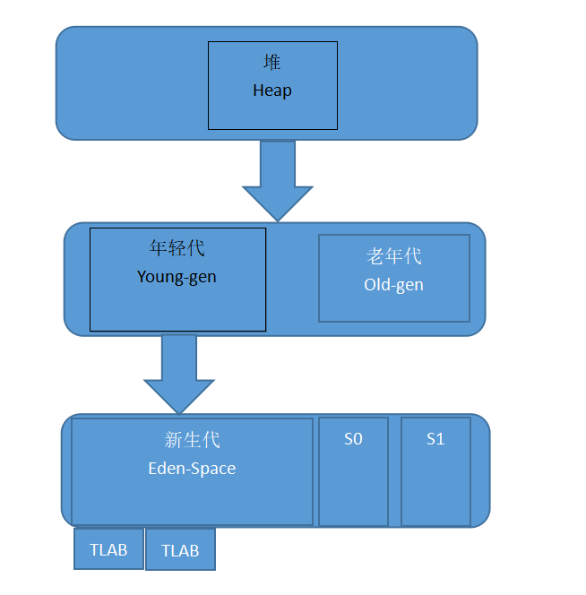
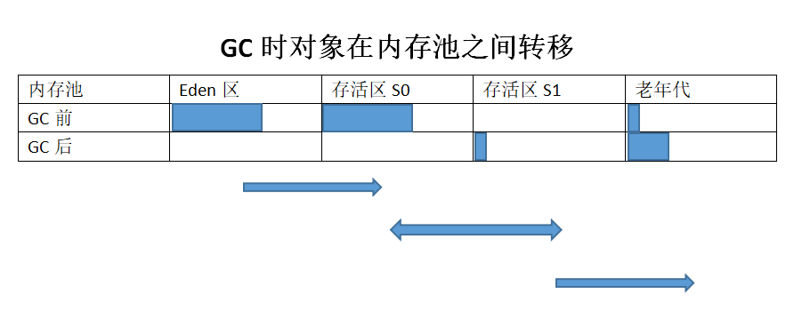

# 前言
GC是英文 “Garbage Collection” 的缩写，中文叫 “垃圾收集”。为什么需要垃圾收集呢？有C/C++编程经验的同学，就知道内存先需要申请，然后使用完了再释放掉，要不然会造成内存泄漏。这些工作都是程序员手工去处理的，如果哪一次只申请了内存，使用后去没释放，那问题就大了。所以为了避免这种问题，GC应运而生，下面来看看GC的原理和算法。

# 常见的GC算法
1. 手动内存管理：
    前面说过，手动去申请内存，然后释放，这种叫 “手动内存管理”。比如C/C++编程里面用的就是这种。
2. 引用计数法：
    手动内存管理经常会忘记释放内存，人总是健忘的，所以与其让每个人都去申请和释放，那还不如让专门的人来干这事，其他人只需要向这个专门的人去申请和归还就行了。每申请一次，使用次数+1，每归还一次，次数-1。这种在简单的业务的时候没什么大问题，复杂的时候就有问题了。
    我们把每个内存分成一个个仓库，每次申请一个仓库次数+1，归还一个次数-1，但是如果两个仓库之间有了依赖关系之后，这个就没办法回收掉了。
    这种情况叫 “内存泄漏”，该释放的没释放，该回收的没回收。如果这种情况很多的情况下，内存很可能被用光，这种就叫 “内存溢出”。
3. 引用追踪(可达性分析)，也叫标记清除算法：
    从引用计数法我们知道有内存泄漏的问题，那么怎么解决这个问题，“引用追踪” 就是为了解决这个问题提出的，第一代自动垃圾收集算法用的是 “引用计数”，第二代自动垃圾收集算法用的是 “引用追踪”。
    引用追踪最主要的是怎么查找可达的对象，然后标记，JVM明确定义了什么是对象的可达性。有一类很明确很具体的对象，称为 “垃圾收集根元素(Garbage Collection Roots)”，只有这些根对象上能访问到的对象才是可达对象，包括：
    - 局部变量(Local variables)
    - 活动线程(Active threads)
    - 静态域(Static fields)
    - JNI引用(JNI references)
    - 其它对象(后面介绍)
    JVM使用标记-清除算法(Mark and Sweep algorithm)，来跟踪所有的可达对象(存活对象)，确保所有不可达对象(non-reachable objects)占用的内存都能被回收。其中包括两步：
    - Marking(标记)：遍历所有的可达对象，在本地内存中分类记下。
    - Sweeping(清除)：这一步保证了，不可达对象所占用的内存，都能被释放。
    JVM中包含了多种GC算法，如 Parallel Scavenge(并行清除)，Parallel Mark + Copy(并行标记+复制)以及CMS，在实现上可能略有不同，但理论上都采用了上面两个步骤。
    标记-清除(Mark and Sweep)是最经典的垃圾收集算法。这个算法有个不好的地方在于需要 STW 停顿(Stop The World pause)，如果不暂停，则对象间的引用关系会一直不停的发生变化，那样就没办法统计了。有很多原因会触发STW停顿，其中垃圾收集是最主要的原因。
4. 碎片整理：
    每次执行清除(Sweeping)，JVM都必须保证不可达对象占用的内存都能被回收。这个时候就像围棋盘上被拿掉一些零散位置的棋子，最终就会产生内存碎片，进而引发两个问题：
    - 写操作越来越耗时，因为寻找一块足够大的空闲内存变得很困难(因为棋盘上没有一整片的空地方)。
    - 在创建新对象时，JVM在连续的块中分配内存，如果碎片很多，直到没有空闲片段能放下新创建的对象时，就会发生内存分配错误(allocation error)。
    要避免这类问题，JVM必须确保碎片问题不失控，因此在垃圾收集过程中，不仅仅是标记和清除，还需要执行 “内存碎片整理” 的过程。这个过程让所有可达对象(reachable objects)依次排列，以减少碎片。就像把棋盘上剩余的棋子都聚到一起，留出来足够大的空余区域。下面是示意图：

5. 分代假设：
    我们前面提到过，执行垃圾收集需要停止整个应用。那么，对象越多，则收集所有垃圾消耗的时间就越长。那可不可以只处理一个较小的内存区域呢？答案是可以的，程序中的大多数可回收的内存可归为两类：
    - 大部分对象很快就不再使用，生命周期较短。
    - 还有一部分不会立即无用，但也不会持续太长时间。
    所以就有了弱代假设，即我们可以根据对象的不同特点，把对象进行分类。JVM中的内存被分为年轻代(Young Generation)和老年代(Old Generation)。这样我们可以根据对象的不同特点，允许采用不同的算法来提高GC的性能。但是这种方法也不是没有任何问题，例如，在不同分代中的对象可能会互相引用。
6. 内存池划分：
    堆内存中的内存池划分也是类似，但是不同的GC算法在实现细节上可能会有所不同，相关概念是一致的。见下图：

7. 新生代(Eden Space):
    也叫 “伊甸区”，是内在中的一个区域，用来分配新创建的对象。通常会有多个线程同时创建多个对象，所以 Eden 区被划分为多个 “线程本地分配缓冲区(Thread Local Allocation Buffer，简称TLAB)”。通过这种缓冲区的划分，大部分对象直接由JVM在对应线程的TLAB中分配，避免与其他线程的同步操作。
    如果TLAB中没有足够的内存空间，就会在共享Eden区(shared Eden space)中分配，如果共享Eden区也没有足够的空间，就会触发一次年轻代GC来释放内存空间。如果GC后Eden区依然没有足够的空闲区域，则对象就会被分配到老年代空间(Old Generation)。
    当Eden区进行垃圾收集时，GC将所有从root可达的对象过一遍，并标记为存活对象。对象间可能会有跨代的引用，所以需要一种方法来标记从其他分代中指向Eden的所有引用，然而这样做又会碰到各个分代之间的相互引用。在JVM实现时，用了一个比较好的办法：“卡片标记(card-marking)”。
    标记阶段完成后，Eden区中所有存活的对象都会被复制到存活区(Survivor spaces)里面。整个Eden区就可以被认为是空的，然后就能用来分配新对象，这种方法被称为 “标记-复制(Mark and Copy)”，存活的对象被标记，然后复制到一个存活区。
8. 存活区(Survivor Spaces)：
    Eden区的旁边是两个存活区(Survivor Spaces)，称为 “from 空间”和“to 空间”。需要着重强调的是，任意时刻总有一个存活区是空的。
    空的那个存活区用于在下一次年轻代GC时存放收集的对象。年轻代中所有的存活对象(包括Eden区和非空的 “from” 存活区)都会被复制到 “to” 存活区，GC过程完成后，“to”区有对象，而“from”区里没有对象，下次就会切换过来操作。如下图：

    存活的对象会在两个存活区之间复制多次，直到某些对象的存活时间达到一定的阀值，根据分代理论的假设，存活超过一定时间的对象很可能会继续存活更长时间，这类对象因此会被提升(promoted)到老年代。提升的时候，存活区对象不再是复制到另一个存活区，而是迁移到老年代，直到在老年代变成不可达对象。
    为了确定一个对象是否“足够老”，也就是可以被提升(Promotion)到老年代，GC模块跟踪会记录每个存活区对象存活的次数，每次分代GC完成后，存活对象的年龄就会增长。当年龄超过提升阈值(tenuring threshold)，就会被提升到老年代。
    具体的提升阈值由JVM动态调整，也可以用参数 “-XX:+MaxTenuringThreshold” 来指定上限，如果设置为0，则GC时存活对象不在存活区之间复制，直接提升到老年代。现代 JVM 中这个阈值默认设置为15个GC周期，这是 HotSpot JVM 中允许的最大值。如果存活区空间不够存放年轻代中的存活对象，提升(Promotion)也可能更早的进行。
9. 老年代(Old Gen):
    老年代的GC实现要复杂得多，老年代内存空间通常会更大，里面的对象是垃圾的概率也小，老年代GC发生的频率比年轻代小很多。因老年代中的对象大部分是存活的，所以不再使用标记和复制(Mark and Copy)算法，而采用移动对象的方式来实现最小化内存碎片。老年代空间的清理算法通常是建立在不同的基础上，一般情况下，会执行以下这些步骤：
    - 通过标志位(marked bit)，标记所有通过 GC Roots可达对象;
    - 删除所有不可达对象;
    - 整理老年代空间中的内容，方法是将所有的存活对象复制，从老年代空间开始的地方依次存放。
    老年代GC必须明确地进行整理，以避免内存碎片过多。
10. 永久代(Perm Gen):
    在Java 8 之前有一个特殊的空间，被称为“永久代(Permanent Generation)”。这是存储元数据(metadata)的地方，比如 class 信息等，此外，这个区域中也保存有其他的数据和信息，包括内部化的字符串(internalized strings)等等。
    实际上这给开发者造成了很多麻烦，因为很难去计算这块区域到底需要占用多少内存空间，预测失败就会导致 “java.lang.OutOfMemoryError: Permgen space” 的错误。如果出现了这个错误就只能增加 Permgen 的大小，当然如果真的是因为内存泄漏导致的，就要另找原因了。设置 perm gen 最大空间的参数： 
    ```
    -XX:+MaxPermSize=256m
    ```
11. 元数据区(Metaspace):
    既然估算元数据所需的空间比较困难，所以 Java 8 里直接删除了永久代(Permanent Generation)，改用 Metaspace。之后，Java中很多杂项就放到了普通的堆内存里。
    当然，类定义(class definitions)之类的信息会被加载到 Metaspace 中，元数据区位于本地内存(native memory)，不再影响普通的 Java 对象。默认情况下，Metaspace 的大小只受限于 Java 进程可用的本地内存，这样程序就不再因为多加载了几个类/JAR包就导致 “java.lang.OutOfMemoryError: Permgen space.”。当然这种不受限制的空间也不是没有代价的，如果 Metaspace 失控，则可能会导致严重影响程序性能的内存交换(swapping)，或者导致本地内存分配失败。
    如果需要避免这种最坏情况，可以通过下面的参数来限制 Metaspace 的大小：
    ```
    -XX:+MaxMetaspaceSize=265m
    ```


