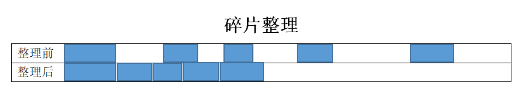

# 前言
GC是英文 “Garbage Collection” 的缩写，中文叫 “垃圾收集”。为什么需要垃圾收集呢？有C/C++编程经验的同学，就知道内存先需要申请，然后使用完了再释放掉，要不然会造成内存泄漏。这些工作都是程序员手工去处理的，如果哪一次只申请了内存，使用后去没释放，那问题就大了。所以为了避免这种问题，GC应运而生，下面来看看GC的原理和算法。

# 常见的GC算法
1. 手动内存管理：
    前面说过，手动去申请内存，然后释放，这种叫 “手动内存管理”。比如C/C++编程里面用的就是这种。
2. 引用计数法：
    手动内存管理经常会忘记释放内存，人总是健忘的，所以与其让每个人都去申请和释放，那还不如让专门的人来干这事，其他人只需要向这个专门的人去申请和归还就行了。每申请一次，使用次数+1，每归还一次，次数-1。这种在简单的业务的时候没什么大问题，复杂的时候就有问题了。
    我们把每个内存分成一个个仓库，每次申请一个仓库次数+1，归还一个次数-1，但是如果两个仓库之间有了依赖关系之后，这个就没办法回收掉了。
    这种情况叫 “内存泄漏”，该释放的没释放，该回收的没回收。如果这种情况很多的情况下，内存很可能被用光，这种就叫 “内存溢出”。
3. 引用追踪(可达性分析)，也叫标记清除算法：
    从引用计数法我们知道有内存泄漏的问题，那么怎么解决这个问题，“引用追踪” 就是为了解决这个问题提出的，第一代自动垃圾收集算法用的是 “引用计数”，第二代自动垃圾收集算法用的是 “引用追踪”。
    引用追踪最主要的是怎么查找可达的对象，然后标记，JVM明确定义了什么是对象的可达性。有一类很明确很具体的对象，称为 “垃圾收集根元素(Garbage Collection Roots)”，只有这些根对象上能访问到的对象才是可达对象，包括：
    - 局部变量(Local variables)
    - 活动线程(Active threads)
    - 静态域(Static fields)
    - JNI引用(JNI references)
    - 其它对象(后面介绍)
    JVM使用标记-清除算法(Mark and Sweep algorithm)，来跟踪所有的可达对象(存活对象)，确保所有不可达对象(non-reachable objects)占用的内存都能被回收。其中包括两步：
    - Marking(标记)：遍历所有的可达对象，在本地内存中分类记下。
    - Sweeping(清除)：这一步保证了，不可达对象所占用的内存，都能被释放。
    JVM中包含了多种GC算法，如 Parallel Scavenge(并行清除)，Parallel Mark + Copy(并行标记+复制)以及CMS，在实现上可能略有不同，但理论上都采用了上面两个步骤。
    标记-清除(Mark and Sweep)是最经典的垃圾收集算法。这个算法有个不好的地方在于需要 STW 停顿(Stop The World pause)，如果不暂停，则对象间的引用关系会一直不停的发生变化，那样就没办法统计了。有很多原因会触发STW停顿，其中垃圾收集是最主要的原因。
4. 碎片整理：
    每次执行清除(Sweeping)，JVM都必须保证不可达对象占用的内存都能被回收。这个时候就像围棋盘上被拿掉一些零散位置的棋子，最终就会产生内存碎片，进而引发两个问题：
    - 写操作越来越耗时，因为寻找一块足够大的空闲内存变得很困难(因为棋盘上没有一整片的空地方)。
    - 在创建新对象时，JVM在连续的块中分配内存，如果碎片很多，直到没有空闲片段能放下新创建的对象时，就会发生内存分配错误(allocation error)。
    要避免这类问题，JVM必须确保碎片问题不失控，因此在垃圾收集过程中，不仅仅是标记和清除，还需要执行 “内存碎片整理” 的过程。这个过程让所有可达对象(reachable objects)依次排列，以减少碎片。就像把棋盘上剩余的棋子都聚到一起，留出来足够大的空余区域。下面是示意图：

